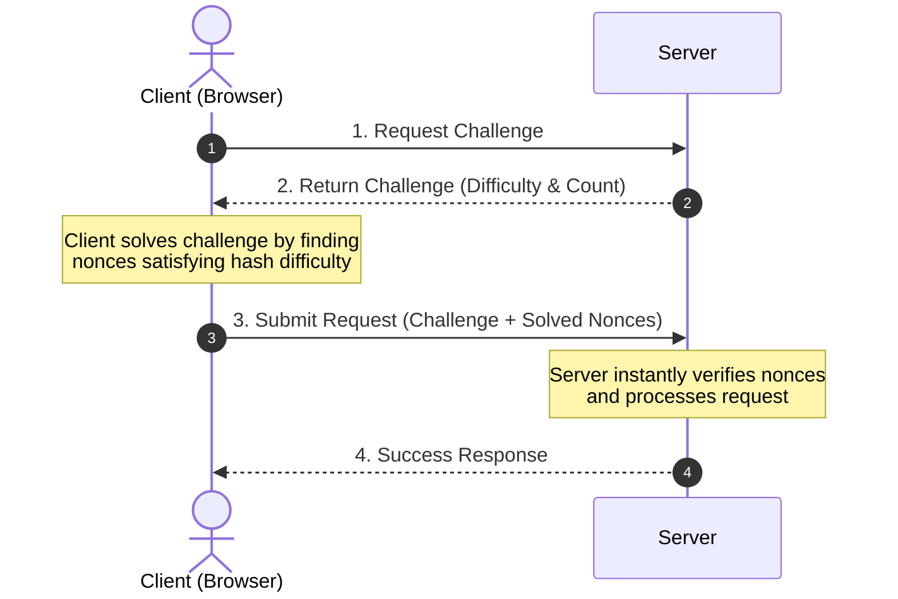

# Proof of Work (PoW) Protection

This repository is a Proof of Concept (PoC) demonstrating how client-side Proof of Work (PoW) can protect server resources from spam, brute-force, or DDoS abuse.

By requiring the client browser to solve a computational puzzle before submitting a request, we introduce an asymmetric cost: **expensive for clients to attack, but extremely cheap for the server to verify.**

## How the Concept Works

### Summary of the PoW concept in this repo:

1. **Challenge Generation (Server):**

   - When a client wants to trigger an action, the server generates a unique challenge payload signed as a **JWT** with a short TTL (e.g., 60s).
   - The challenge dictates the mining parameters: `d` (difficulty: required leading zero bits in the SHA-256 hash) and `c` (count: number of nonces/hashes to find).

2. **Client-Side Solving:**

   - The client runs a background worker to find numeric nonces that, when hashed with the challenge, yield a SHA-256 hash with the required number of leading zero bits.

3. **Asymmetric Verification (Server):**
   - The client sends the solved `nonces` back with the signed challenge.
   - The server validates the JWT signature/expiration and uses an **LRU double-spend cache** to prevent replay attacks.
   - The server performs exactly `c` hashes to verify that the nonces satisfy the difficulty `d` (extremely fast to verify compared to the client's search effort).
